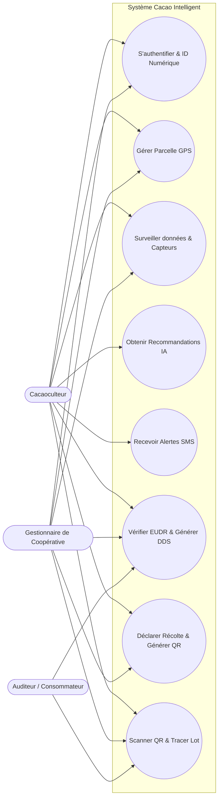
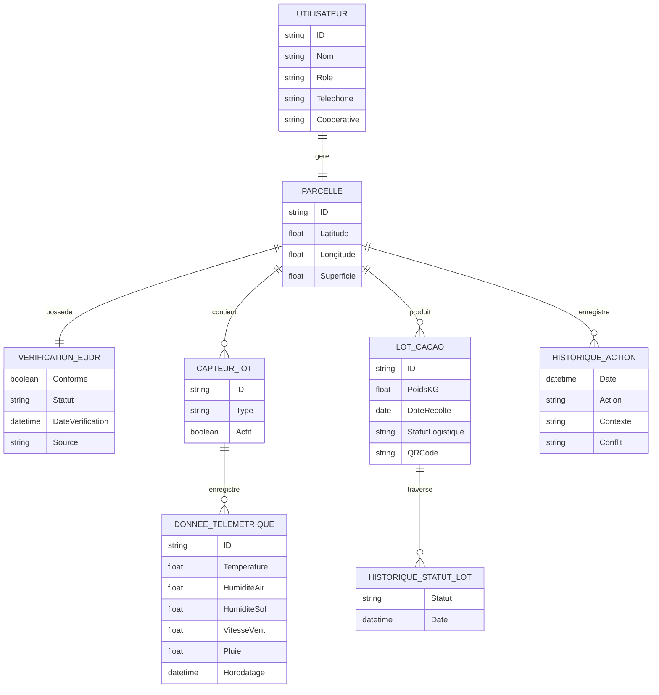

# Modèle de Documentation Technique

**Nom du Projet :** Cacao Intelligent  
**Nom de l'Équipe :** AgriTech Innovators  
**Membres de l'Équipe :** [Insérer les Noms]  
**Date :** 16 Mars 2026  

## 1. Résumé Exécutif

Cacao Intelligent est une plateforme innovante IoT et pilotée par l'Intelligence Artificielle conçue pour optimiser la gestion des plantations de cacao, spécifiquement adaptée aux conditions environnementales d'Abidjan, en Côte d'Ivoire. Le problème central que nous abordons est le manque de prise de décision basée sur les données en temps réel dans la cacaoculture, aggravé par le besoin urgent de se conformer aux réglementations environnementales strictes telles que la réglementation européenne sur la déforestation importée (EUDR) post-2020.

La proposition de valeur fondamentale de notre application réside dans l'intégration transparente de capteurs IoT sur le terrain (ESP32) avec des modèles prédictifs d'IA avancés et des bases de données environnementales mondiales. Elle donne aux agriculteurs des recommandations précises pour l'irrigation, l'application de pesticides et la détection de maladies (ex: la pourriture brune / Blackpod) afin de maximiser les rendements et de minimiser la surutilisation de produits chimiques. Simultanément, elle vérifie automatiquement le statut de déforestation des terres via l'API Global Forest Watch et génère des Déclarations de Diligence Raisonnée (DDS) rigoureuses sous forme de PDF, garantissant une traçabilité complète de bout en bout de la chaîne d'approvisionnement via des codes QR transparents.

## 2. Récits Utilisateurs (User Stories)

* **En tant que cacaoculteur**, je souhaite surveiller les données microclimatiques en temps réel et recevoir des recommandations pilotées par l'IA pour l'irrigation et les pesticides, afin d'optimiser la santé de mes cultures et de réduire le gaspillage de ressources.
* **En tant que cacaoculteur**, je souhaite obtenir un Identifiant Numérique lié à ma parcelle GPS, afin de faciliter la traçabilité de mes produits et d'accéder plus facilement aux subventions et services financiers.
* **En tant que gestionnaire de coopérative / exportateur**, je souhaite vérifier automatiquement le statut de non-déforestation des parcelles de cacao et générer des Déclarations de Diligence Raisonnée (DDS), afin de pouvoir facilement maintenir la conformité EUDR pour l'exportation.
* **En tant qu'auditeur de la chaîne d'approvisionnement / consommateur**, je souhaite scanner un code QR attaché à un lot de cacao, afin de pouvoir vérifier l'intégralité de son parcours (du champ jusqu'à l'exportation) et valider son origine géographique et sa durabilité.
* **En tant qu'agriculteur**, je souhaite recevoir des alertes SMS immédiates concernant des événements météorologiques critiques ou des risques de maladies, afin de pouvoir prendre des mesures préventives rapides.

## 3. Cas d'Utilisation du Système

* **Diagramme des Cas d'Utilisation :**

* **Descriptions Fonctionnelles :**
  * **Identité Numérique (Conforme SNOI - ANSI Côte d'Ivoire) & Authentification :** Chaque agriculteur obtient un ID numérique unique, rigoureusement lié à sa parcelle GPS. Ce module gère l'authentification sécurisée (potentiellement via MOSIP), ce qui lui permet ensuite, *en dehors du système*, d'accéder aux subventions (cet aspect financier n'étant pas une fonctionnalité gérée par la plateforme Cacao Intelligent elle-même).
  * **Distinction des Acteurs (Agriculteur vs Coopérative) :** L'agriculteur s'authentifie pour renseigner ses données (GPS, capteurs), déclarer sa récolte initiale et consulter les conseils de l'IA. La Coopérative s'authentifie pour consolider les données de ses membres, modifier les statuts logistiques d'un lot (de En Attente à Collecté, En Transit, ou Exporté) et assumer la charge administrative de génération des rapports légaux EUDR (DDS).
  * **Ingestion de Données IoT :** Les capteurs ESP32 envoient en continu des données de télémétrie (température, humidité, conditions du sol) au backend.
  * **Aide à la Décision par IA & Détection de Maladies :** Évaluation des variables environnementales pour recommander des pulvérisations de pesticides ou une irrigation en toute sécurité. L'analyse d'images est utilisée pour détecter les anomalies des cabosses comme les dommages causés par le Frostypod ou les mirides.
  * **Conformité EUDR & Génération de DDS :** Le système interroge des API externes (Global Forest Watch) avec les coordonnées GPS de la parcelle pour confirmer l'absence de déforestation après 2020, puis compile ces données en un document PDF de Diligence Raisonnée juridiquement viable.
  * **Suivi de Traçabilité QR :** La plateforme met à jour les limites des lots à travers différents états logistiques (En attente, Collecté, En transit, Exporté) et les associe à des codes QR dynamiques pour un scan public.

## 4. Architecture du Système

* **Diagramme d'Architecture :**
```mermaid
graph TD
    subgraph Frontend [Dashboard Utilisateur - Streamlit]
        UI[Interface Web / Mobile]
        Auth[Gestion des Profils & Auth]
        Lot[Gestion des Lots & QR Code]
        DDS[Générateur PDF DDS]
    end

    subgraph Backend [Serveur API - Flask]
        API[Point d'Entrée API]
        Logic[Logique Métier]
        subgraph Machine_Learning [Modèles d'IA]
            ML_Irrigation[Modèle Irrigation]
            ML_Pesticide[Modèle Pesticide / Maladies]
        end
        SMS[Service d'Alerte SMS]
    end

    subgraph Database [Stockage Local]
        JSON[(agriculteurs.json)]
    end

    subgraph External_APIs [API Tierces & Gouvernementales]
        GFW[API Global Forest Watch - EUDR]
        Twilio[API Twilio - SMS]
        MOSIP[MOSIP / SNOI - Identité Numérique (ANSI CI)]
    end

    subgraph IoT_Devices [Capteurs sur le Terrain]
        ESP32[Capteurs ESP32 - T°, Humidité, Sol]
    end

    %% Connections
    UI <--> Auth
    UI <--> Lot
    UI <--> DDS
    UI <--> API

    API <--> Logic
    Logic <--> ML_Irrigation
    Logic <--> ML_Pesticide
    Logic <--> SMS
    Logic <--> JSON

    ESP32 -->|Données Télémétriques| API
    
    DDS -->|Vérification GPS| GFW
    SMS -->|Envoi Notification| Twilio
    Auth -.->|Validation ID Agriculteur| MOSIP
```
* **Pile Technologique (Tech Stack) :**
  * **Frontend :** Streamlit (Python) pour un tableau de bord analytique réactif et rapide à itérer.
  * **Backend :** Flask (Python) propulsant l'API principale, gérant la logique métier, la gestion d'état et l'inférence des modèles ML.
  * **Base de données :** Stockage d'objets local basé sur JSON (`agriculteurs.json`) pour un suivi léger des profils, de l'historique et des lots en relation avec l'ID numérique SNOI.
  * **Infrastructure :** Environnements Virtuels Python standards (`venv`, `venv_tf`); adapté pour une future conteneurisation Docker et un déploiement cloud.
  * **IA & Machine Learning :** TensorFlow/Keras et scikit-learn pour les modèles prédictifs entraînés (`.h5`, `.pkl`).
  * **API Tierces :** API Twilio (Alertes SMS), API Global Forest Watch (Vérification Environnementale), intégration MOSIP conforme à la Stratégie Nationale de l'Identité Numérique (SNOI - ANSI Côte d'Ivoire).

## 5. Modèle de Données & Conception

* **Diagramme Entité-Association (ERD) :**

* **Outils Clés :** 
  * **Streamlit & Flask :** Découplage rapide frontend-backend.
  * **ReportLab :** Génération dynamique de documents PDF robustes pour les rapports DDS.
  * **TensorFlow / Keras :** Pour le chargement de modèles d'apprentissage en profondeur pré-entraînés afin d'effectuer une classification complexe des maladies basée sur l'image.
  * **SDK Twilio :** Pour l'envoi asynchrone d'alertes SMS en toute sécurité.
  * **Bibliothèques de Génération de QR Codes :** Pour l'encodage des représentations JSON des lots, cartographiant les points de la chaîne d'approvisionnement vérifiables.
  * **API Global Forest Watch :** Fourniture de vérifications géospatiales critiques pour la conformité à la non-déforestation.

---
**Rappel des Instructions de Soumission :**
* **Enregistrer sous :** [NomDeLeuipe]_Technical_Documentation.pdf
* **Soumettre à :** blamptey@andrew.cmu.edu
* **Date limite :** Lundi 16 Mars 2026 (Délai de rigueur)
